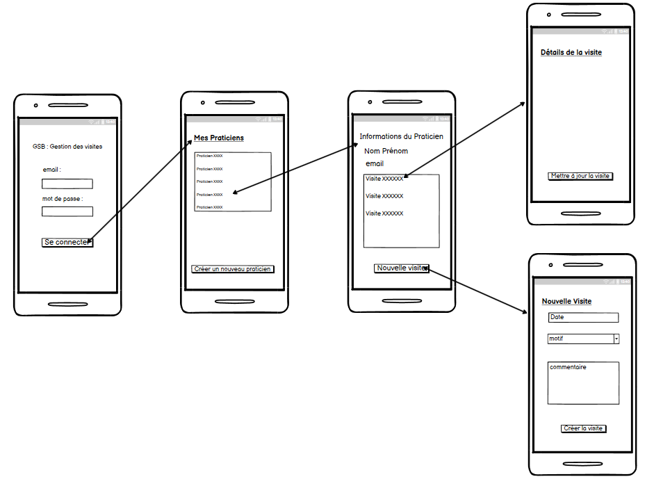

# GSB - Application Android de Gestion des Visites Médicales

## 📄 Présentation du projet

Cette application mobile Android permet de gérer les visites médicales des délégués pharmaceutiques de l'entreprise fictive Galaxy Swiss Bourdin (GSB). 

Les fonctionnalités principales incluent la gestion :
- des praticiens (médecins, spécialistes)
- des visites effectuées (compte-rendus)

Le but est de faciliter la collecte, la consultation et la mise à jour de ces données sur mobile.

## 🏢 Organisation support

**Galaxy Swiss Bourdin (GSB)** est une entreprise fictive utilisée dans le cadre du BTS SIO. Elle commercialise des produits pharmaceutiques et dispose de nombreux délégués visitant les praticiens.

## 🧑‍💻 Compétences E6 mobilisées

- **Concevoir et développer une solution applicative**
- **Assurer la maintenance corrective ou évolutive d’une solution applicative**
- **Gérer les données**

## 🔧 Ressources matérielles et logicielles utilisées

- **Matériel** : PC de développement
- **Système d'exploitation** : Windows / Linux / MacOS
- **IDE** : Android Studio
- **Langages** : Java / XML
- **Base de données** : SQLite (intégrée à Android)
- **Architecture** : Activités + DataBinding

## 📊 Fonctionnalités principales

### Gestion des Praticiens
- **Lister** tous les praticiens existants
- **Afficher** les détails d’un praticien (spécialité, téléphone, etc.)
- **Ajouter** un nouveau praticien
- **Modifier** les informations d’un praticien
- **Supprimer** un praticien

### Gestion des Visites
- **Lister** toutes les visites programmées ou réalisées
- **Afficher** les détails d’une visite (date, compte-rendu)
- **Ajouter** une nouvelle visite pour un praticien
- **Modifier** ou **supprimer** une visite existante

## 🔄 Architecture de l'application

- **Activities** : chaque écran principal correspond à une Activity
- **DataBinding** : liaison entre les données et les vues
- **SQLite** : stockage local des données utilisateurs (praticiens et visites)

## 📋 Description détaillée des fonctionnalités

### Gestion des Praticiens
- **Lister les praticiens** : Affichage de tous les praticiens enregistrés en base locale (SQLite) sous forme de liste.
- **Afficher les détails d’un praticien** : Consultation de la fiche détaillée d’un praticien (nom, prénom, spécialité, téléphone, adresse email, ville).
- **Ajouter un praticien** : Formulaire de création accessible depuis `CreatePraticienActivity`.
- **Modifier un praticien** : Modification des informations existantes via `PraticienDetailsActivity`.
- **Supprimer un praticien** : Suppression définitive d’un praticien depuis la fiche détail.

### Gestion des Visites
- **Lister les visites** : Affichage de toutes les visites réalisées ou programmées.
- **Afficher les détails d’une visite** : Consultation des informations détaillées d’une visite (date, motif, commentaire, praticien associé).
- **Ajouter une visite** : Formulaire de création de visite disponible dans `CreateVisiteActivity`.
- **Modifier une visite** : Mise à jour des informations d'une visite via `UpdateVisiteActivity`.
- **Supprimer une visite** : Suppression définitive d'une visite existante.

---

## 🎛️ Description détaillée du fonctionnement des contrôleurs

### MainActivity
- Activity principale à l’ouverture de l’application.
- Gère la navigation vers `HomeActivity` et les vérifications d’accès.

### HomeActivity
- Tableau de bord principal.
- Permet d'accéder à la gestion des praticiens et des visites via des boutons.

### CreatePraticienActivity
- Formulaire de saisie pour ajouter un nouveau praticien.
- Enregistre les informations saisies dans la base SQLite après validation.

### PraticienDetailsActivity
- Affiche les informations complètes d'un praticien sélectionné.
- Propose la modification ou la suppression du praticien.

### CreateVisiteActivity
- Formulaire de création d’une nouvelle visite.
- Permet de sélectionner un praticien existant et de saisir les détails de la visite.

### VisiteDetailActivity
- Affiche les détails d’une visite spécifique.
- Permet la modification ou la suppression de la visite.

### UpdateVisiteActivity
- Permet la modification d’une visite existante.
- Affiche un formulaire pré-rempli avec les informations actuelles.

---

## 🔄 Workflow Général
- L'utilisateur démarre sur `MainActivity`.
- Il est redirigé vers `HomeActivity`.
- Depuis `HomeActivity`, il accède soit à la liste des praticiens, soit à la liste des visites.
- Toutes les actions (ajout, modification, suppression) sont synchronisées avec la base de données SQLite.
- Utilisation de DataBinding pour lier les données aux interfaces utilisateurs.

## 📱 Maquettage de l'application


## 🛠️ Stack Technique

- **Android SDK** : 30+
- **Gradle** : gestionnaire de dépendances
- **DataBinding** : pour la gestion propre des vues
- **Java** : langage principal
- **SQLite** : pour la persistance locale

## 📈 Schéma de données

**Table Praticiens**
* _id
* nom
* prenom
* tel
* email
* rue
* code_postal
* ville

**Table Visite**
* _id
* date_visite
* commentaire
* visiteur
* praticien
* motif

**Table Motif**
- _id
- libelle

**Table Visiteurs**
* visiteurId
* token
* nom
* prenom
* email
* tel
* dateEmbauche

## 🛡️ Backend/API Associé : Gestion des Rapports de Visite

### 🌍 Api disponible sur GitHub : [GSB_SaperliExpress](https://github.com/Bili-and-sheep/GSB_SaperliExpress.git)
### 🔗 Présentation
Cette API REST en **Node.js / Express.js** permet de gérer les **rapports de visite** réalisés par les visiteurs médicaux.

### ⚙️ Technologies utilisées
- **Node.js** / **Express.js**
- **MongoDB** ou **PostgreSQL**
- **JWT** pour l'authentification sécurisée
- **Express-rate-limit** pour la protection brute-force

### 🚀 Fonctionnalités de l'API
- Gestion des utilisateurs (inscription, connexion)
- CRUD complet sur les rapports de visite
- Authentification par jeton (JWT)
- Sécurisation avancée (chiffrement, protection XSS, limitation de requêtes)

### 🧪 Déploiement de l'API
```bash
# Cloner le projet
git clone https://github.com/Bili-and-sheep/GSB_SaperliExpress.git
cd GSB_SaperliExpress
```
```bash
# Installer les dépendances
npm init -y
npm install
```
```bash
# Lancer l'API
npx ts-node server.ts
```

## 📆 Période de réalisation

- **De** : Septembre 2024
- **À** : Avril 2025
- **Lieu** : OSINT Frindly
- **Modalité** : Travail individuel

---

> Réalisé dans le cadre de l'épreuve E6 - BTS SIO 2025 - Option SLAM.
